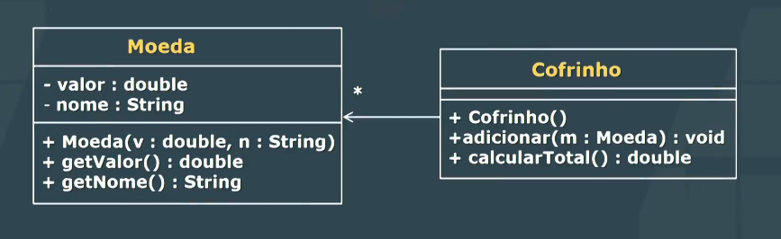

## Aula 3 - Visibilidade

Essa pasta contém atividades da terceira aula da matéria de Programação Orientada a Objetos com Java, no curso de Análise e Desenvolvimento de Sistemas, na UNINTER.

### Sobre a Matéria

Programação Orientada a Objetos com Java é uma disciplina que aborda os conceitos fundamentais da programação orientada a objetos utilizando a linguagem Java. Os alunos aprendem sobre classes, objetos, herança, polimorfismo, encapsulamento, entre outros conceitos essenciais.

### Exercícios

#### Ex01

- Classe Nota
    - Dois atributos privados
        - Double nota1
        - Double nota2
    - Cinco métodos públicos
        - void setNota1(double)
        - void setNota2(double)
        - double getNota1()
        - double getNota2()
        - void resultado()
- O método resultado() deve imprimir a média e se o aluno está aprovado, reprovado ou de final. No caso de estar de final, o quanto de nota precisa na final.

Arquivo: `/ex01/App.java`

#### Ex02

- Adicionar o atributo faltas. No resultado, para quem tiver acima de sete faltas, imprimir "reprovado por faltas".

Arquivo: `/ex01/App.java`

#### Ex03

- Crie uma classe Aluno com os:
    - Atributos:
        - String nome
        - int matricula
        - double desconto
        - Curso curso
    - Métodos:
        - descrever()
        - pagamento() //Informa o preço que o aluno paga, considerando seu desconto e o preço de seu curso
- E a classe Curso com os:
    - Atributos:
        - String nome
        - double mensalidade
    - Métodos:
        - descrever()

Arquivo: `/ex03/App.java`

#### Ex04

- 

Arquivo: `/ex04/App.java`

### Como executar

1. **Compile todas as classes**:<br>
   Navegue até o diretório raiz do projeto `.../java-get-started/ADS-College/exercises-class-3` e compile todas as classes Java no pacote `ex01`:

   ```sh
   javac -d bin src/ex01/*.java
   javac -d bin src/ex03/*.java
   javac -d bin src/ex04/*.java
   ```

2. **Execute a classe principal**:<br>
    Após a compilação, execute a classe principal App a partir do diretório raiz do projeto, especificando o pacote correspondente:

    ```sh
    java -cp bin ex01.App
    java -cp bin ex03.App
    java -cp bin ex04.App
    ```   

### Estrutura de Pastas

O workspace contém duas pastas por padrão, onde:

- `src`: a pasta para manter os códigos-fonte
- `lib`: a pasta para manter as dependências

Enquanto isso, os arquivos compilados serão gerados na pasta `bin` por padrão.

> Se você quiser personalizar a estrutura de pastas, abra `.vscode/settings.json` e atualize as configurações relacionadas lá.
