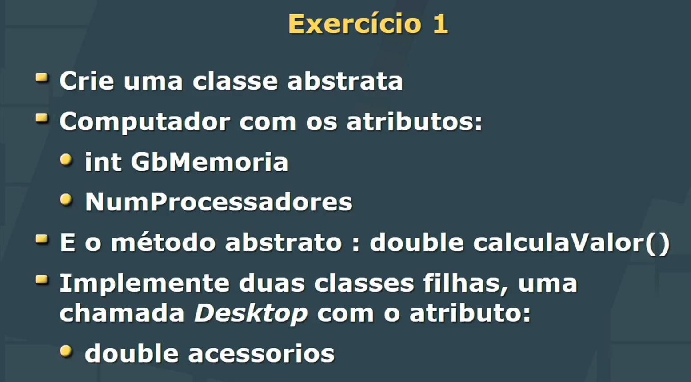

## Aula 5 - Polimorfismo

Essa pasta contém atividades da quinta aula da matéria de Programação Orientada a Objetos com Java, no curso de Análise e Desenvolvimento de Sistemas, na UNINTER.

### Sobre a Matéria

Programação Orientada a Objetos com Java é uma disciplina que aborda os conceitos fundamentais da programação orientada a objetos utilizando a linguagem Java. Os alunos aprendem sobre classes, objetos, herança, polimorfismo, encapsulamento, entre outros conceitos essenciais.

### Exercícios

#### Ex01




#### Ex02


### Como executar

1. **Compile todas as classes**:<br>
   Navegue até o diretório raiz do projeto `.../java-get-started/ADS-College/exercises-class-5` e compile todas as classes Java no pacote `ex01`:

   ```sh
   javac -d bin src/ex01/*.java
   javac -d bin src/ex02/*.java
   ```

2. **Execute a classe principal**:<br>
    Após a compilação, execute a classe principal App a partir do diretório raiz do projeto, especificando o pacote correspondente:

    ```sh
    java -cp bin ex01.App
    java -cp bin ex02.App
    ```   

### Estrutura de Pastas

O workspace contém duas pastas por padrão, onde:

- `src`: a pasta para manter os códigos-fonte
- `lib`: a pasta para manter as dependências

Enquanto isso, os arquivos compilados serão gerados na pasta `bin` por padrão.

> Se você quiser personalizar a estrutura de pastas, abra `.vscode/settings.json` e atualize as configurações relacionadas lá.
